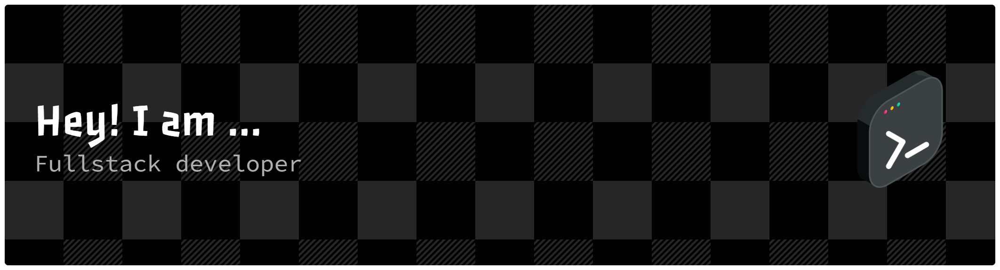

## Hi there 👋

# 💫 About Me:

* 🔭 Working on backend projects & DSA
* 👯 Open to collaborating on backend & full-stack apps
* 🤝 Seeking guidance on scalable systems & clean code
* 🌱 Learning APIs, databases & DevOps
* 💬 Ask me about Java, MERN & problem solving
* ⚡ Fun fact: I enjoy building from scratch & simplifying complex logic

---

## 🌐 Connect with Me:

---

# 💻 Tech Stack:

### 🚀 Languages

### ⚛️ Frontend

### ⚙️ Backend & Frameworks

### 🗄️ Databases

### 🛠️ Tools & Technologies

---

# 📊 GitHub Stats:

---

## 🏆 GitHub Trophies

---

### ✍️ Dev Quote

---

